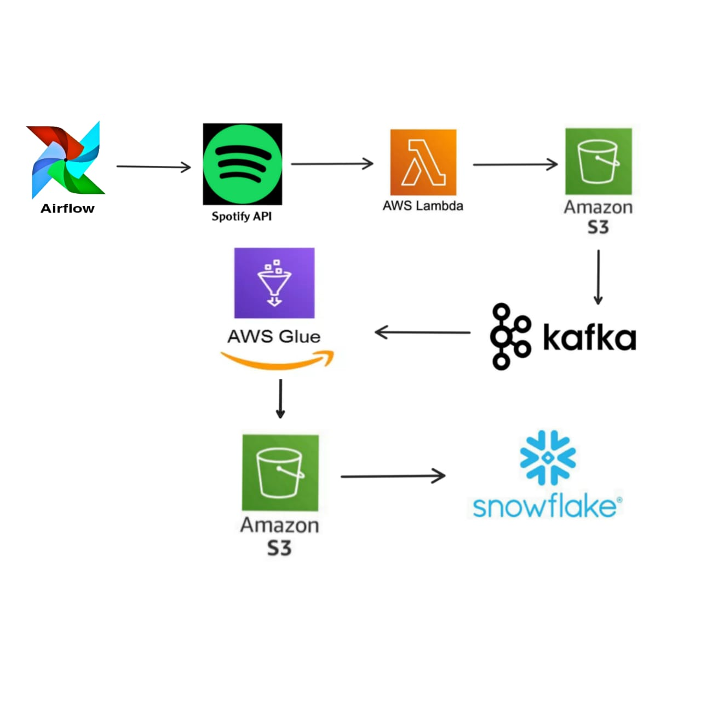

# 🎧 Spotify StreamFlow

A real-time data pipeline that extracts music metadata from Spotify, transforms it via AWS Lambda, streams it using Kafka, processes it with AWS Glue, and loads the cleaned data into Snowflake. This entire workflow is orchestrated using Apache Airflow.

### 🗺️ Architecture

### 🚀 Tech Stack

- **Spotify API** – Playlist data source  
- **AWS Lambda** – Extraction and transformation  
- **Amazon S3** – Raw and processed data storage  
- **Apache Kafka** – Streaming transformed data  
- **AWS Glue** – Data cleaning & unification  
- **Snowflake** – Final analytics-ready warehouse  
- **Apache Airflow** – Pipeline orchestration

### 🔄 Pipeline Steps

1. ⚙️**Lambda 1 – Extraction**
   - Extracts Spotify playlist data using Spotipy
   - Saves raw JSON to `s3://ec2kafkabucket/raw_data/to_processed/`

2. 🧪**Lambda 2 – Transform & Kafka**
   - Reads raw files from S3
   - Extracts albums, artists, and songs
   - Uploads CSVs to `transformed_data/`
   - Sends data to Kafka topic `spotify-topic`

3. 🔬**AWS Glue**
   - Reads from Kafka
   - Cleans, deduplicates, merges data
   - Saves unified CSV to `s3://ec2gluebucket/processed-data/spotify_clean_data.csv/`

4. ❄️**Snowflake**
   - Reads from S3 using external stage
   - Loads into `spotify_data` table

### 📈 Future Improvements

- 🧩 **Schema Registry Integration**  
  Add Apache Avro + Schema Registry for better data governance in Kafka.

- 🔔 **Alerting & Monitoring**  
  Integrate Slack or email notifications using Airflow or CloudWatch alarms.

- 🚀 **Snowpipe for Real-Time Ingestion**  
  Replace manual Snowflake COPY with automated ingestion via Snowpipe.

- 🧹 **Glue Crawler Automation**  
  Automatically infer schema from S3 data using AWS Glue Crawlers.

- 📊 **Visualization Layer**  
  Connect Snowflake to BI tools like Tableau, Power BI, or Superset.

### ✅ Conclusion

**Spotify StreamFlow** demonstrates how to build a scalable, modular, and automated data pipeline using modern cloud-native tools. From raw API extraction to real-time Kafka streaming and Snowflake warehousing — this project highlights key concepts in data engineering, orchestration, and ETL best practices.
